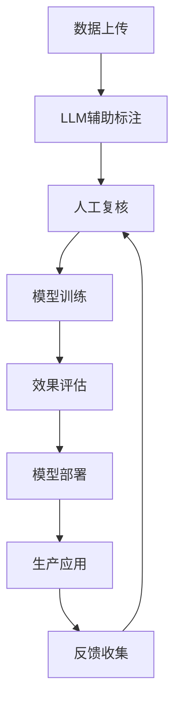

# 情感分析助手

[](https://python.org)
[](https://flask.palletsprojects.com)
[](https://github.com/isnowfy/snownlp)
[](LICENSE)

基于 SnowNLP 的智能情感分析系统，集成大语言模型辅助标注、自定义模型训练和全面效果评估。专为中文文本情感分析设计，提供现代化的可视化界面和完整的工作流程。

## ✨ 核心特性

### 🎯 智能化标注
- **多模型支持**：集成 OpenAI GPT、百度千帆、阿里通义千问等 LLM
- **智能建议**：自动分析文本情感倾向，提供置信度评分
- **人工校准**：支持人工审核和修正，确保标注质量
- **批量处理**：高效处理大量文本数据
- **增量学习**：根据人工反馈持续优化建议准确性

### 🤖 专业训练
- **多算法支持**：朴素贝叶斯、SVM、逻辑回归、随机森林等
- **智能调参**：自动推荐最优参数配置
- **交叉验证**：确保模型泛化能力
- **增量训练**：支持在线学习和模型更新
- **模型版本管理**：保存和比较不同版本模型

### 📊 深度评估
- **多维度指标**：准确率、精确率、召回率、F1-score、AUC 等
- **可视化分析**：混淆矩阵、ROC 曲线、特征重要性图
- **对比分析**：自定义模型 vs 基线模型性能对比
- **错误分析**：详细的预测失败案例分析
- **A/B 测试**：支持多模型同时评估

### 🎨 现代化界面
- **响应式设计**：完美适配桌面、平板、手机
- **玻璃拟态风格**：现代化的毛玻璃视觉效果
- **交互式图表**：基于 Chart.js 的丰富数据可视化
- **实时反馈**：即时状态更新和进度显示
- **无障碍设计**：符合 WCAG 2.1 标准

## 🎥 功能演示

> 注：演示截图展示了系统的主要功能界面

### 主要界面展示
- 📊 **数据概览页面**：统计信息、数据分布图表
- 🏷️ **智能标注界面**：LLM 辅助标注、实时预览
- 🤖 **模型训练中心**：参数配置、训练监控
- 📈 **效果评估面板**：多维度性能分析

## 🔧 技术架构

### 后端技术栈
- **Web 框架**：Flask 2.3+ (轻量级、灵活)
- **核心算法**：SnowNLP (中文处理优化)
- **机器学习**：scikit-learn (经典算法)
- **数据处理**：pandas, numpy (高效数据操作)
- **可视化**：matplotlib, seaborn (统计图表)
- **异步处理**：Celery (可选，用于大数据处理)

### 前端技术栈
- **UI 框架**：Bootstrap 5.3 (响应式设计)
- **图表库**：Chart.js 4.4 (交互式图表)
- **图标库**：Bootstrap Icons (矢量图标)
- **样式技术**：CSS3 玻璃拟态、CSS Grid、Flexbox
- **交互逻辑**：原生 JavaScript (ES6+)

### LLM 集成架构
- **OpenAI API**：GPT-3.5/4 系列模型
- **国产大模型**：百度千帆、阿里通义、腾讯混元
- **本地模型**：支持 Ollama、ChatGLM 等本地部署
- **容错机制**：多层级降级策略，确保服务可用性

## 🚀 系统要求

### 最低要求
- **操作系统**：Windows 10/11, macOS 10.15+, Ubuntu 18.04+
- **Python 版本**：Python 3.8 或更高
- **内存**：4GB RAM (推荐 8GB+)
- **存储空间**：500MB 可用空间
- **网络**：稳定的互联网连接 (用于 LLM API 调用)

### 推荐配置
- **处理器**：Intel i5 或 AMD Ryzen 5 同等性能
- **内存**：16GB RAM
- **存储**：SSD 硬盘
- **显卡**：支持 CUDA 的 NVIDIA 显卡 (可选，用于加速训练)

## 📦 快速安装

### 方式一：标准安装 (推荐)

```bash
# 1. 克隆项目
git clone https://github.com/your-username/sentiment-analysis.git
cd sentiment-analysis

# 2. 创建虚拟环境
python -m venv venv

# 3. 激活虚拟环境
# Windows:
venv\Scripts\activate
# macOS/Linux:
source venv/bin/activate

# 4. 升级 pip
python -m pip install --upgrade pip

# 5. 安装依赖
pip install -r requirements.txt

# 6. 验证安装
python -c "import snownlp, flask, sklearn; print('安装成功！')"
```

### 方式二：Docker 部署 (即将支持)

```bash
# 构建镜像
docker build -t sentiment-analysis .

# 运行容器
docker run -p 5000:5000 -v ./data:/app/data sentiment-analysis
```

### 方式三：一键脚本安装

```bash
# 下载并运行安装脚本
curl -fsSL https://raw.githubusercontent.com/your-username/sentiment-analysis/main/install.sh | bash
```

## ⚙️ 详细配置

### 环境变量配置

创建 `.env` 文件：

```env
# === 基础配置 ===
FLASK_ENV=production
FLASK_DEBUG=False
SECRET_KEY=your-secret-key-here

# === 数据库配置 ===
DATABASE_URL=sqlite:///sentiment.db
REDIS_URL=redis://localhost:6379/0

# === LLM API 配置 ===
# OpenAI
OPENAI_API_KEY=sk-your-api-key
OPENAI_BASE_URL=https://api.openai.com/v1
OPENAI_MODEL=gpt-3.5-turbo
OPENAI_MAX_TOKENS=1000
OPENAI_TEMPERATURE=0.3

# 百度千帆
QIANFAN_ACCESS_KEY=your-access-key
QIANFAN_SECRET_KEY=your-secret-key
QIANFAN_MODEL=ERNIE-Bot

# 阿里通义千问
DASHSCOPE_API_KEY=your-api-key
DASHSCOPE_MODEL=qwen-plus

# 腾讯混元
HUNYUAN_SECRET_ID=your-secret-id
HUNYUAN_SECRET_KEY=your-secret-key

# === 安全配置 ===
ALLOWED_HOSTS=localhost,127.0.0.1
CORS_ORIGINS=http://localhost:3000,http://localhost:5000
API_RATE_LIMIT=100/hour

# === 文件存储配置 ===
UPLOAD_FOLDER=uploads
MAX_CONTENT_LENGTH=16777216  # 16MB
ALLOWED_EXTENSIONS=txt,json,csv
```

### 高级配置选项

```python
# config.py
class Config:
    # 训练配置
    DEFAULT_TEST_SIZE = 0.2
    DEFAULT_MAX_FEATURES = 10000
    DEFAULT_NGRAM_RANGE = (1, 2)
    
    # 性能配置
    CACHE_TIMEOUT = 300  # 5分钟
    MAX_WORKERS = 4      # 并发处理数
    BATCH_SIZE = 100     # 批处理大小
    
    # 安全配置
    CSRF_ENABLED = True
    SESSION_TIMEOUT = 3600  # 1小时
    API_AUTH_REQUIRED = False
```

## 🎯 使用指南

### 工作流程概览



### 1. 数据准备与上传

#### 支持的数据格式
- **JSON 格式**：`{"text": "文本内容", "label": 1, "timestamp": "2023-12-01"}`
- **CSV 格式**：`text,label,timestamp`
- **TXT 格式**：每行一条文本（用于批量预测）

#### 数据质量检查
- ✅ 文本长度：1-1000 字符
- ✅ 字符编码：UTF-8
- ✅ 内容过滤：自动去除特殊字符、表情符号
- ✅ 重复检测：自动标识重复文本

### 2. 智能标注流程

#### LLM 辅助标注
```python
# 标注提示词模板
PROMPT_TEMPLATE = """
请分析以下中文文本的情感倾向：

文本：{text}

请从以下维度进行分析：
1. 整体情感倾向（正面/负面/中性）
2. 情感强度（1-10分）
3. 关键情感词汇
4. 置信度（0-1）

请以JSON格式返回结果。
"""
```

#### 标注质量控制
- **一致性检查**：同一文本多次标注结果对比
- **专家审核**：可设置专家审核环节
- **主动学习**：优先标注模型不确定的样本
- **标注协议**：制定详细的标注指南

### 3. 模型训练策略

#### 算法选择建议
| 算法 | 适用场景 | 优点 | 缺点 |
|------|----------|------|------|
| 朴素贝叶斯 | 文本分类经典算法 | 快速、效果稳定 | 特征独立性假设 |
| SVM | 小样本、高维特征 | 泛化能力强 | 训练时间较长 |
| 逻辑回归 | 需要概率输出 | 可解释性好 | 线性假设限制 |
| 随机森林 | 非线性关系复杂 | 防过拟合 | 内存消耗大 |

#### 超参数调优
```python
# 网格搜索参数空间
param_grid = {
    'max_features': [5000, 10000, 20000],
    'ngram_range': [(1,1), (1,2), (1,3)],
    'min_df': [1, 2, 5],
    'max_df': [0.8, 0.9, 1.0]
}
```

### 4. 性能评估指标

#### 核心指标解释
- **准确率 (Accuracy)**：整体预测正确的比例
- **精确率 (Precision)**：预测为正例中真正正例的比例
- **召回率 (Recall)**：真正正例中被预测为正例的比例
- **F1-Score**：精确率和召回率的调和平均数
- **AUC-ROC**：ROC 曲线下的面积，衡量分类器性能

#### 评估最佳实践
- **交叉验证**：使用 5 折或 10 折交叉验证
- **分层抽样**：保证训练测试集标签分布一致
- **时间分割**：按时间划分训练测试集（适用时序数据）
- **外部验证**：使用独立数据集验证模型泛化能力

## 🔐 安全注意事项

### API 密钥安全
- ✅ 使用环境变量存储敏感信息
- ✅ 定期轮换 API 密钥
- ✅ 设置 API 调用频率限制
- ✅ 监控异常访问行为

### 数据隐私保护
- ✅ 敏感数据加密存储
- ✅ 访问权限控制
- ✅ 数据脱敏处理
- ✅ 符合 GDPR/个人信息保护法

### 系统安全
- ✅ CSRF 防护
- ✅ SQL 注入防护
- ✅ XSS 攻击防护
- ✅ 文件上传安全检查

## 🚀 部署指南

### 开发环境部署

```bash
# 启动开发服务器
python app.py

# 或使用 Flask CLI
export FLASK_APP=app.py
export FLASK_ENV=development
flask run --host=0.0.0.0 --port=5000
```

### 生产环境部署

#### 使用 Gunicorn (推荐)
```bash
# 安装 Gunicorn
pip install gunicorn

# 启动服务
gunicorn -w 4 -b 0.0.0.0:5000 app:app
```

#### 使用 Nginx 反向代理
```nginx
server {
    listen 80;
    server_name your-domain.com;
    
    location / {
        proxy_pass http://127.0.0.1:5000;
        proxy_set_header Host $host;
        proxy_set_header X-Real-IP $remote_addr;
        proxy_set_header X-Forwarded-For $proxy_add_x_forwarded_for;
    }
    
    location /static {
        alias /path/to/your/app/static;
        expires 1y;
        add_header Cache-Control "public, immutable";
    }
}
```

#### Docker 容器化部署
```dockerfile
FROM python:3.9-slim

WORKDIR /app
COPY requirements.txt .
RUN pip install --no-cache-dir -r requirements.txt

COPY . .
EXPOSE 5000

CMD ["gunicorn", "-w", "4", "-b", "0.0.0.0:5000", "app:app"]
```

### 云平台部署

#### 阿里云 ECS
1. 创建 ECS 实例（推荐 2核4G 配置）
2. 安装 Docker 和 Docker Compose
3. 配置安全组开放 80/443 端口
4. 使用 SLB 做负载均衡

#### 腾讯云 CVM
1. 选择合适的 CVM 实例
2. 配置 CDN 加速静态资源
3. 使用 COS 存储大文件
4. 配置监控和告警

## ⚡ 性能优化

### 后端优化
- **数据库索引**：为查询字段建立合适索引
- **缓存策略**：使用 Redis 缓存频繁查询结果
- **异步处理**：大数据量处理使用 Celery 异步任务
- **连接池**：配置数据库连接池减少连接开销

### 前端优化
- **资源压缩**：CSS/JS 文件压缩和合并
- **图片优化**：使用 WebP 格式，实现懒加载
- **CDN 加速**：静态资源使用 CDN 分发
- **缓存策略**：合理设置浏览器缓存策略

### 模型优化
- **特征选择**：使用卡方检验等方法选择重要特征
- **模型压缩**：使用模型蒸馏技术减小模型体积
- **量化加速**：8位量化减少内存占用
- **推理优化**：使用 ONNX 等格式优化推理速度

## 🔧 故障排除

### 常见问题解决

#### 1. 安装依赖失败
```bash
# 问题：pip install 失败
# 解决：使用国内镜像源
pip install -r requirements.txt -i https://pypi.douban.com/simple/

# 问题：SnowNLP 安装失败
# 解决：先安装必要的编译工具
# Ubuntu/Debian:
sudo apt-get install python3-dev build-essential
# CentOS/RHEL:
sudo yum install python3-devel gcc
```

#### 2. LLM API 调用失败
```python
# 问题：API 调用超时
# 解决：检查网络连接和 API 密钥
import requests
try:
    response = requests.get('https://api.openai.com/v1/models', 
                          headers={'Authorization': 'Bearer YOUR_API_KEY'})
    print(response.status_code)
except Exception as e:
    print(f"连接失败: {e}")
```

#### 3. 训练过程中内存不足
```python
# 问题：内存溢出
# 解决：分批处理数据
def train_in_batches(data, batch_size=1000):
    for i in range(0, len(data), batch_size):
        batch = data[i:i+batch_size]
        # 处理批次数据
        yield batch
```

#### 4. 界面加载缓慢
```html
<!-- 问题：CDN 资源加载慢 -->
<!-- 解决：使用国内 CDN -->
<link href="https://cdn.bootcdn.net/ajax/libs/bootstrap/5.3.2/css/bootstrap.min.css" rel="stylesheet">
```

### 日志分析

#### 启用详细日志
```python
import logging

logging.basicConfig(
    level=logging.INFO,
    format='%(asctime)s - %(name)s - %(levelname)s - %(message)s',
    handlers=[
        logging.FileHandler('sentiment_analysis.log'),
        logging.StreamHandler()
    ]
)
```

#### 监控关键指标
- **响应时间**：API 接口响应时间
- **错误率**：请求失败率
- **资源使用**：CPU、内存、磁盘使用率
- **模型性能**：预测准确率变化趋势

## 🔧 故障排除

### 常见问题解决

#### 1. 安装依赖失败
```bash
# 问题：pip install 失败
# 解决：使用国内镜像源
pip install -r requirements.txt -i https://pypi.douban.com/simple/

# 问题：SnowNLP 安装失败
# 解决：先安装必要的编译工具
# Ubuntu/Debian:
sudo apt-get install python3-dev build-essential
# CentOS/RHEL:
sudo yum install python3-devel gcc
```

#### 2. LLM API 调用失败
```python
# 问题：API 调用超时
# 解决：检查网络连接和 API 密钥
import requests
try:
    response = requests.get('https://api.openai.com/v1/models', 
                          headers={'Authorization': 'Bearer YOUR_API_KEY'})
    print(response.status_code)
except Exception as e:
    print(f"连接失败: {e}")
```

#### 3. 训练过程中内存不足
```python
# 问题：内存溢出
# 解决：分批处理数据
def train_in_batches(data, batch_size=1000):
    for i in range(0, len(data), batch_size):
        batch = data[i:i+batch_size]
        # 处理批次数据
        yield batch
```

#### 4. 界面加载缓慢
```html
<!-- 问题：CDN 资源加载慢 -->
<!-- 解决：使用国内 CDN -->
<link href="https://cdn.bootcdn.net/ajax/libs/bootstrap/5.3.2/css/bootstrap.min.css" rel="stylesheet">
```

### 日志分析

#### 启用详细日志
```python
import logging

logging.basicConfig(
    level=logging.INFO,
    format='%(asctime)s - %(name)s - %(levelname)s - %(message)s',
    handlers=[
        logging.FileHandler('sentiment_analysis.log'),
        logging.StreamHandler()
    ]
)
```

#### 监控关键指标
- **响应时间**：API 接口响应时间
- **错误率**：请求失败率
- **资源使用**：CPU、内存、磁盘使用率
- **模型性能**：预测准确率变化趋势

## 🚀 部署指南

### 开发环境部署

```bash
# 启动开发服务器
python app.py

# 或使用 Flask CLI
export FLASK_APP=app.py
export FLASK_ENV=development
flask run --host=0.0.0.0 --port=5000
```

### 生产环境部署

#### 使用 Gunicorn (推荐)
```bash
# 安装 Gunicorn
pip install gunicorn

# 启动服务
gunicorn -w 4 -b 0.0.0.0:5000 app:app
```

#### 使用 Nginx 反向代理
```nginx
server {
    listen 80;
    server_name your-domain.com;
    
    location / {
        proxy_pass http://127.0.0.1:5000;
        proxy_set_header Host $host;
        proxy_set_header X-Real-IP $remote_addr;
        proxy_set_header X-Forwarded-For $proxy_add_x_forwarded_for;
    }
    
    location /static {
        alias /path/to/your/app/static;
        expires 1y;
        add_header Cache-Control "public, immutable";
    }
}
```

#### Docker 容器化部署
```dockerfile
FROM python:3.9-slim

WORKDIR /app
COPY requirements.txt .
RUN pip install --no-cache-dir -r requirements.txt

COPY . .
EXPOSE 5000

CMD ["gunicorn", "-w", "4", "-b", "0.0.0.0:5000", "app:app"]
```

### 云平台部署

#### 阿里云 ECS
1. 创建 ECS 实例（推荐 2核4G 配置）
2. 安装 Docker 和 Docker Compose
3. 配置安全组开放 80/443 端口
4. 使用 SLB 做负载均衡

#### 腾讯云 CVM
1. 选择合适的 CVM 实例
2. 配置 CDN 加速静态资源
3. 使用 COS 存储大文件
4. 配置监控和告警

## ⚡ 性能优化

### 后端优化
- **数据库索引**：为查询字段建立合适索引
- **缓存策略**：使用 Redis 缓存频繁查询结果
- **异步处理**：大数据量处理使用 Celery 异步任务
- **连接池**：配置数据库连接池减少连接开销

### 前端优化
- **资源压缩**：CSS/JS 文件压缩和合并
- **图片优化**：使用 WebP 格式，实现懒加载
- **CDN 加速**：静态资源使用 CDN 分发
- **缓存策略**：合理设置浏览器缓存策略

### 模型优化
- **特征选择**：使用卡方检验等方法选择重要特征
- **模型压缩**：使用模型蒸馏技术减小模型体积
- **量化加速**：8位量化减少内存占用
- **推理优化**：使用 ONNX 等格式优化推理速度

## 🔐 安全注意事项

### API 密钥安全
- ✅ 使用环境变量存储敏感信息
- ✅ 定期轮换 API 密钥
- ✅ 设置 API 调用频率限制
- ✅ 监控异常访问行为

### 数据隐私保护
- ✅ 敏感数据加密存储
- ✅ 访问权限控制
- ✅ 数据脱敏处理
- ✅ 符合 GDPR/个人信息保护法

### 系统安全
- ✅ CSRF 防护
- ✅ SQL 注入防护
- ✅ XSS 攻击防护
- ✅ 文件上传安全检查

## 📊 API 文档概览

### 核心 API 端点

#### 数据管理
```http
GET    /api/data              # 获取标注数据列表
POST   /api/data              # 添加新的标注数据
PUT    /api/data/{id}         # 更新指定数据
DELETE /api/data/{id}         # 删除指定数据
```

#### LLM 辅助标注
```http
POST   /api/llm_suggest       # 获取 LLM 标注建议
POST   /api/batch_annotate    # 批量标注处理
```

#### 模型训练
```http
POST   /api/train_model       # 开始模型训练
GET    /api/training_status   # 获取训练状态
GET    /api/model_list        # 获取模型列表
```

#### 效果评估
```http
POST   /api/evaluate_model    # 模型性能评估
GET    /api/evaluation_history # 获取评估历史
POST   /api/predict           # 使用模型预测
```

#### 系统状态
```http
GET    /api/stats             # 系统统计信息
GET    /api/health            # 健康检查
GET    /api/version           # 版本信息
```

### 请求示例

#### 获取 LLM 标注建议
```bash
curl -X POST http://localhost:5000/api/llm_suggest \
  -H "Content-Type: application/json" \
  -d '{
    "text": "今天天气真不错，心情特别好！",
    "provider": "openai"
  }'
```

#### 开始模型训练
```bash
curl -X POST http://localhost:5000/api/train_model \
  -H "Content-Type: application/json" \
  -d '{
    "algorithm": "naive_bayes",
    "test_size": 0.2,
    "max_features": 10000,
    "ngram_range": [1, 2]
  }'
```

## 🤝 贡献指南

### 开发环境设置

```bash
# 1. Fork 项目到您的 GitHub 账户
# 2. 克隆 Fork 的项目
git clone https://github.com/YOUR_USERNAME/sentiment-analysis.git
cd sentiment-analysis

# 3. 创建开发分支
git checkout -b feature/your-feature-name

# 4. 安装开发依赖
pip install -r requirements-dev.txt

# 5. 安装 pre-commit 钩子
pre-commit install
```

### 代码规范

#### Python 代码风格
- 使用 **Black** 格式化代码
- 使用 **flake8** 进行代码检查
- 使用 **mypy** 进行类型检查
- 遵循 **PEP 8** 命名规范

```bash
# 代码格式化
black .

# 代码检查
flake8 .

# 类型检查
mypy .
```

#### 前端代码风格
- 使用 **Prettier** 格式化 JavaScript/CSS
- 遵循 **Airbnb** JavaScript 风格指南
- 使用语义化的 HTML 结构

### 提交规范

使用 [Conventional Commits](https://www.conventionalcommits.org/) 规范：

```
feat: 添加新功能
fix: 修复 bug
docs: 更新文档
style: 代码格式调整
refactor: 代码重构
test: 添加测试
chore: 构建工具或辅助工具的变动
```

示例：
```bash
git commit -m "feat: 添加批量数据导入功能"
git commit -m "fix: 修复模型训练内存泄漏问题"
git commit -m "docs: 完善 API 文档说明"
```

### Pull Request 流程

1. **确保代码质量**：通过所有测试和代码检查
2. **更新文档**：相应更新 README 和 API 文档
3. **添加测试**：为新功能添加单元测试
4. **描述清晰**：详细描述变更内容和原因
5. **小步迭代**：保持 PR 小而聚焦

### 功能建议

欢迎提出以下类型的贡献：

- 🌟 **新功能**：情感细粒度分析、多语言支持
- 🐛 **Bug 修复**：性能优化、兼容性改进
- 📚 **文档完善**：用户指南、开发文档
- 🧪 **测试用例**：单元测试、集成测试
- 🎨 **界面优化**：用户体验改进、无障碍优化

## 📈 路线图

### v1.1.0 (计划中)
- ✨ 支持多语言情感分析
- ✨ 增加情感细粒度分类（愤怒、喜悦、悲伤等）
- ✨ 集成更多国产大模型
- ✨ 添加 RESTful API 认证
- ✨ 支持 Docker 一键部署

### v1.2.0 (规划中)
- ✨ 实时情感分析流处理
- ✨ 分布式训练支持
- ✨ 模型自动优化和 AutoML
- ✨ 企业级权限管理
- ✨ 多租户支持

### v2.0.0 (远期目标)
- ✨ 基于 Transformer 的深度学习模型
- ✨ 云原生架构重构
- ✨ 微服务化拆分
- ✨ 支持私有化部署
- ✨ 商业智能分析报告

## 📄 许可证

本项目采用 [MIT 许可证](LICENSE)。

```
MIT License

Copyright (c) 2023 情感分析系统

Permission is hereby granted, free of charge, to any person obtaining a copy
of this software and associated documentation files (the "Software"), to deal
in the Software without restriction, including without limitation the rights
to use, copy, modify, merge, publish, distribute, sublicense, and/or sell
copies of the Software, and to permit persons to whom the Software is
furnished to do so, subject to the following conditions:

The above copyright notice and this permission notice shall be included in all
copies or substantial portions of the Software.

THE SOFTWARE IS PROVIDED "AS IS", WITHOUT WARRANTY OF ANY KIND, EXPRESS OR
IMPLIED, INCLUDING BUT NOT LIMITED TO THE WARRANTIES OF MERCHANTABILITY,
FITNESS FOR A PARTICULAR PURPOSE AND NONINFRINGEMENT. IN NO EVENT SHALL THE
AUTHORS OR COPYRIGHT HOLDERS BE LIABLE FOR ANY CLAIM, DAMAGES OR OTHER
LIABILITY, WHETHER IN AN ACTION OF CONTRACT, TORT OR OTHERWISE, ARISING FROM,
OUT OF OR IN CONNECTION WITH THE SOFTWARE OR THE USE OR OTHER DEALINGS IN THE
SOFTWARE.
```

## 🙏 致谢

感谢以下开源项目和贡献者：

- [SnowNLP](https://github.com/isnowfy/snownlp) - 中文情感分析核心库
- [Flask](https://flask.palletsprojects.com/) - 轻量级 Web 框架
- [scikit-learn](https://scikit-learn.org/) - 机器学习算法库
- [Bootstrap](https://getbootstrap.com/) - 响应式 UI 框架
- [Chart.js](https://www.chartjs.org/) - 交互式图表库

特别感谢所有提交 Issue、PR 和提供反馈的社区成员！

## 📞 联系我们

- 📧 **邮箱**：support@sentiment-analysis.com
- 💬 **QQ 群**：123456789 (情感分析交流群)
- 🐛 **Bug 报告**：[GitHub Issues](https://github.com/your-username/sentiment-analysis/issues)
- 💡 **功能建议**：[GitHub Discussions](https://github.com/your-username/sentiment-analysis/discussions)
- 📖 **在线文档**：[文档中心](https://docs.sentiment-analysis.com)

---

<div align="center">

**如果这个项目对您有帮助，请给我们一个 ⭐ Star！**

[⬆ 返回顶部](#情感分析助手)

</div>