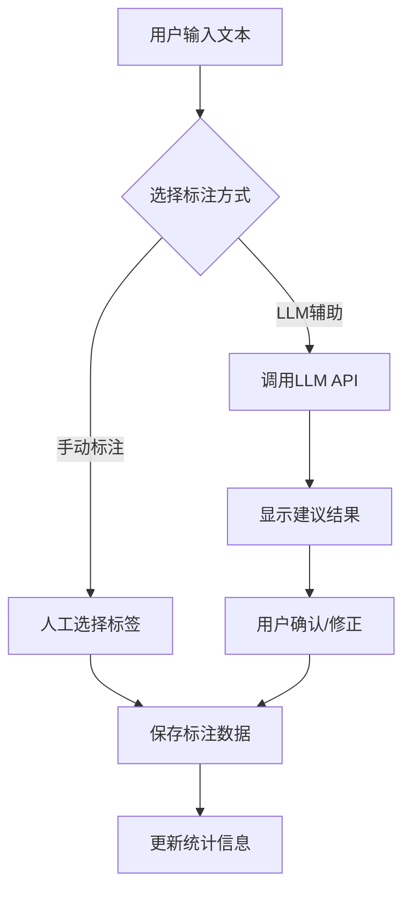
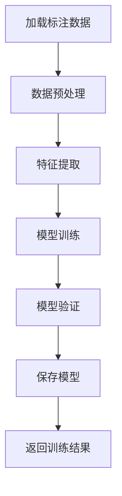
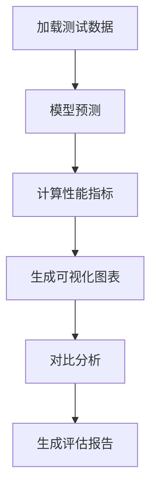

# 情感分析助手 - 详细技术文档

## 项目概述

本项目是一个基于 SnowNLP 的智能情感分析系统，集成了 LLM 辅助标注、自定义模型训练和效果评估功能。系统采用现代化的 Web 界面，为用户提供完整的情感分析工作流。

## 系统架构

### 整体架构图

```
┌─────────────────────────────────────────────────────────────┐
│                    前端界面层                                  │
├─────────────────────────────────────────────────────────────┤
│  主页Dashboard │ 数据标注 │ 模型训练 │ 效果评估                 │
│  - 统计展示     │ - LLM辅助 │ - 算法选择│ - 性能对比               │
│  - 快速测试     │ - 人工标注│ - 参数调优│ - 可视化分析             │
└─────────────────────────────────────────────────────────────┘
                               │
┌─────────────────────────────────────────────────────────────┐
│                    API 接口层                                 │
├─────────────────────────────────────────────────────────────┤
│ /api/data       │ /api/llm_suggest │ /api/train_model        │
│ /api/stats      │ /api/evaluate    │ 其他 API 端点           │
└─────────────────────────────────────────────────────────────┘
                               │
┌─────────────────────────────────────────────────────────────┐
│                   业务逻辑层                                  │
├─────────────────────────────────────────────────────────────┤
│ SentimentAnalyzer │ LLM集成模块 │ 训练评估模块               │
│ - 模型管理        │ - API调用    │ - 性能指标                 │
│ - 预测推理        │ - 结果解析   │ - 数据可视化               │
└─────────────────────────────────────────────────────────────┘
                               │
┌─────────────────────────────────────────────────────────────┐
│                   数据存储层                                  │
├─────────────────────────────────────────────────────────────┤
│ sentiment_data.json │ trained_model.pkl │ evaluation_results.json │
│ - 标注数据存储      │ - 模型文件存储    │ - 评估结果缓存           │
└─────────────────────────────────────────────────────────────┘
```

### 核心组件说明

#### 1. SentimentAnalyzer 类
负责情感分析的核心逻辑：
```python
class SentimentAnalyzer:
    def __init__(self):
        self.model = None
        self.load_model()
    
    def predict(self, text):
        # 使用训练好的模型或 SnowNLP 进行预测
    
    def train_model(self, texts, labels):
        # 训练自定义模型
    
    def get_sentiment_score(self, text):
        # 获取情感分数
```

#### 2. LLM 集成模块
支持多种 LLM API 的统一接口：
```python
def get_llm_suggestion(text):
    try:
        # 调用配置的 LLM API
        # 支持 OpenAI、百度、阿里等
        return llm_prediction
    except Exception:
        # 降级使用 SnowNLP
        return snownlp_prediction
```

#### 3. 数据管理模块
统一的数据存储和访问接口：
- JSON 格式存储标注数据
- Pickle 格式存储训练模型
- 支持数据导入导出

## 技术实现细节

### 前端技术栈

#### 1. Bootstrap 5 响应式框架
- 使用最新的 Bootstrap 5.3.0
- 自定义 CSS 变量实现主题定制
- 响应式网格系统适配移动端

#### 2. Chart.js 数据可视化
```javascript
// 饼图配置示例
new Chart(ctx, {
    type: 'doughnut',
    data: {
        labels: ['正面情感', '负面情感', '未标注'],
        datasets: [{
            data: [positive, negative, unlabeled],
            backgroundColor: ['#28a745', '#dc3545', '#6c757d']
        }]
    }
});
```

#### 3. 现代 JavaScript 特性
- 使用 async/await 处理异步请求
- ES6+ 语法糖提升代码可读性
- 模块化设计便于维护

### 后端技术栈

#### 1. Flask Web 框架
```python
app = Flask(__name__)
app.config['SECRET_KEY'] = 'your-secret-key'

@app.route('/api/data', methods=['GET', 'POST'])
def handle_data():
    # RESTful API 设计
    pass
```

#### 2. SnowNLP 中文处理
```python
from snownlp import SnowNLP

def analyze_sentiment(text):
    s = SnowNLP(text)
    return {
        'sentiment': 1 if s.sentiments > 0.5 else 0,
        'confidence': s.sentiments
    }
```

#### 3. scikit-learn 机器学习
```python
from sklearn.pipeline import Pipeline
from sklearn.feature_extraction.text import TfidfVectorizer
from sklearn.naive_bayes import MultinomialNB

pipeline = Pipeline([
    ('tfidf', TfidfVectorizer(max_features=5000)),
    ('classifier', MultinomialNB())
])
```

### 数据流程设计

#### 1. 数据标注流程


#### 2. 模型训练流程


#### 3. 效果评估流程


## API 接口文档

### 1. 数据管理接口

#### GET /api/data
获取所有标注数据
```json
Response: [
    {
        "text": "这个产品很好用",
        "label": 1,
        "timestamp": "2024-01-01T10:00:00"
    }
]
```

#### POST /api/data
保存新的标注数据
```json
Request: {
    "text": "这个产品很好用",
    "label": 1
}
Response: {
    "status": "success"
}
```

### 2. LLM 辅助接口

#### POST /api/llm_suggest
获取 LLM 标注建议
```json
Request: {
    "text": "这个产品很好用"
}
Response: {
    "llm_suggestion": 1,
    "confidence_score": 0.85,
    "snownlp_prediction": 1
}
```

### 3. 模型训练接口

#### POST /api/train_model
训练自定义模型
```json
Request: {
    "train_test_split": 0.8,
    "model_type": "naive_bayes",
    "max_features": 5000
}
Response: {
    "status": "success",
    "message": "模型训练完成，使用50条数据"
}
```

### 4. 模型评估接口

#### POST /api/evaluate_model
评估模型性能
```json
Response: {
    "status": "success",
    "results": {
        "test_size": 10,
        "custom_model": {
            "accuracy": 0.85,
            "precision": 0.87,
            "recall": 0.83,
            "f1_score": 0.85
        },
        "snownlp_baseline": {
            "accuracy": 0.75,
            "precision": 0.77,
            "recall": 0.73,
            "f1_score": 0.75
        }
    }
}
```

### 5. 统计信息接口

#### GET /api/stats
获取数据统计信息
```json
Response: {
    "total_data": 100,
    "labeled_data": 80,
    "positive_count": 45,
    "negative_count": 35
}
```

## 性能优化策略

### 1. 前端优化
- **CDN 加速**：使用 bootcdn 等国内 CDN
- **图片优化**：使用 WebP 格式，懒加载
- **代码压缩**：生产环境压缩 CSS/JS
- **缓存策略**：合理设置静态资源缓存

### 2. 后端优化
- **数据库优化**：使用索引，优化查询
- **缓存机制**：Redis 缓存热点数据
- **异步处理**：Celery 处理长时间任务
- **连接池**：数据库连接池管理

### 3. 模型优化
- **特征选择**：TF-IDF 特征降维
- **模型压缩**：量化压缩模型体积
- **批量预测**：批处理提升效率
- **模型缓存**：内存缓存常用模型

## 安全性考虑

### 1. 输入验证
```python
def validate_input(text):
    if not text or len(text) > 1000:
        raise ValueError("文本长度不合法")
    
    # SQL 注入防护
    text = html.escape(text)
    return text
```

### 2. API 安全
- **CSRF 保护**：使用 CSRF Token
- **速率限制**：限制 API 调用频率
- **身份验证**：JWT Token 认证
- **HTTPS 加密**：生产环境强制 HTTPS

### 3. 数据安全
- **敏感数据加密**：API 密钥加密存储
- **访问控制**：基于角色的权限管理
- **审计日志**：记录关键操作日志
- **数据备份**：定期备份重要数据

## 部署指南

### 1. 开发环境部署
```bash
# 创建虚拟环境
python -m venv venv
source venv/bin/activate  # Windows: venv\Scripts\activate

# 安装依赖
pip install -r requirements.txt

# 配置环境变量
cp config.env.example .env
# 编辑 .env 文件

# 启动应用
python app.py
```

### 2. 生产环境部署

#### 使用 Gunicorn + Nginx
```bash
# 安装 Gunicorn
pip install gunicorn

# 启动应用
gunicorn -w 4 -b 0.0.0.0:5000 app:app
```

#### Nginx 配置
```nginx
server {
    listen 80;
    server_name your-domain.com;
    
    location / {
        proxy_pass http://127.0.0.1:5000;
        proxy_set_header Host $host;
        proxy_set_header X-Real-IP $remote_addr;
    }
    
    location /static {
        alias /path/to/static;
        expires 1y;
    }
}
```

#### Docker 部署
```dockerfile
FROM python:3.9-slim

WORKDIR /app
COPY requirements.txt .
RUN pip install -r requirements.txt

COPY . .
EXPOSE 5000

CMD ["gunicorn", "-w", "4", "-b", "0.0.0.0:5000", "app:app"]
```

### 3. 云平台部署
- **腾讯云**：使用云服务器 + 云数据库
- **阿里云**：使用 ECS + RDS + Redis
- **AWS**：使用 EC2 + RDS + ElastiCache

## 监控与运维

### 1. 应用监控
- **性能监控**：响应时间、吞吐量
- **错误监控**：异常日志、错误率
- **资源监控**：CPU、内存、磁盘使用率

### 2. 日志管理
```python
import logging
from logging.handlers import RotatingFileHandler

# 配置日志
logging.basicConfig(
    handlers=[RotatingFileHandler('app.log', maxBytes=100000, backupCount=10)],
    level=logging.INFO,
    format='%(asctime)s %(levelname)s %(name)s %(message)s'
)
```

### 3. 健康检查
```python
@app.route('/health')
def health_check():
    return {
        'status': 'healthy',
        'timestamp': datetime.now().isoformat(),
        'version': '1.0.0'
    }
```

## 扩展开发指南

### 1. 添加新的 LLM API
```python
def call_custom_llm_api(text):
    """添加自定义 LLM API 调用"""
    # 实现具体的 API 调用逻辑
    pass

def get_llm_suggestion(text):
    try:
        if os.getenv('CUSTOM_LLM_ENABLED'):
            return call_custom_llm_api(text)
        # 其他 LLM 调用逻辑
    except Exception:
        # 降级处理
        pass
```

### 2. 添加新的机器学习算法
```python
from sklearn.svm import SVC
from sklearn.linear_model import LogisticRegression

def create_model(model_type):
    models = {
        'naive_bayes': MultinomialNB(),
        'svm': SVC(probability=True),
        'logistic': LogisticRegression(),
        # 添加新算法
        'random_forest': RandomForestClassifier()
    }
    return models.get(model_type, MultinomialNB())
```

### 3. 添加新的评估指标
```python
from sklearn.metrics import matthews_corrcoef, roc_auc_score

def calculate_advanced_metrics(y_true, y_pred, y_proba):
    return {
        'mcc': matthews_corrcoef(y_true, y_pred),
        'auc': roc_auc_score(y_true, y_proba),
        # 添加更多指标
    }
```

## 故障排除

### 1. 常见错误及解决方案

#### 模块导入错误
```bash
ModuleNotFoundError: No module named 'xxx'
# 解决：pip install xxx
```

#### API 调用失败
```python
# 检查网络连接和 API 密钥配置
if not os.getenv('OPENAI_API_KEY'):
    logger.warning("OpenAI API key not configured")
```

#### 模型训练失败
```python
# 检查训练数据格式和数量
if len(training_data) < 10:
    raise ValueError("训练数据不足")
```

### 2. 性能问题诊断
- **内存泄漏**：使用 memory_profiler 分析
- **CPU 占用高**：使用 cProfile 性能分析
- **数据库慢查询**：启用慢查询日志

### 3. 调试技巧
```python
# 启用详细日志
logging.getLogger().setLevel(logging.DEBUG)

# 添加调试断点
import pdb; pdb.set_trace()

# 性能计时
import time
start_time = time.time()
# 业务逻辑
print(f"执行时间: {time.time() - start_time}秒")
```

## 版本更新计划

### v1.1.0 计划功能
- [ ] 支持批量文本导入
- [ ] 增加更多 LLM API 支持
- [ ] 优化模型训练性能
- [ ] 添加用户权限管理

### v1.2.0 计划功能
- [ ] 支持多标签分类
- [ ] 增加模型版本管理
- [ ] 添加 A/B 测试功能
- [ ] 集成深度学习模型

### v2.0.0 计划功能
- [ ] 微服务架构重构
- [ ] 分布式训练支持
- [ ] 实时流式处理
- [ ] 多语言支持

## 贡献指南

### 1. 代码规范
- 遵循 PEP 8 Python 编码规范
- 使用 black 格式化代码
- 添加必要的注释和文档字符串

### 2. 提交规范
```bash
# 提交信息格式
feat: 添加新功能
fix: 修复 bug
docs: 更新文档
style: 代码格式调整
refactor: 代码重构
test: 添加测试
chore: 构建过程或辅助工具的变动
```

### 3. Pull Request 流程
1. Fork 项目到个人仓库
2. 创建特性分支
3. 提交代码并推送
4. 创建 Pull Request
5. 代码审查和合并

## 联系方式

如有问题或建议，请通过以下方式联系：

- **GitHub Issues**：提交 bug 报告和功能请求
- **邮箱**：your-email@example.com
- **QQ 群**：123456789

## 致谢

感谢以下开源项目的支持：
- [SnowNLP](https://github.com/isnowfy/snownlp) - 中文情感分析库
- [Flask](https://flask.palletsprojects.com/) - Web 框架
- [Bootstrap](https://getbootstrap.com/) - 前端框架
- [Chart.js](https://www.chartjs.org/) - 图表库
- [scikit-learn](https://scikit-learn.org/) - 机器学习库 